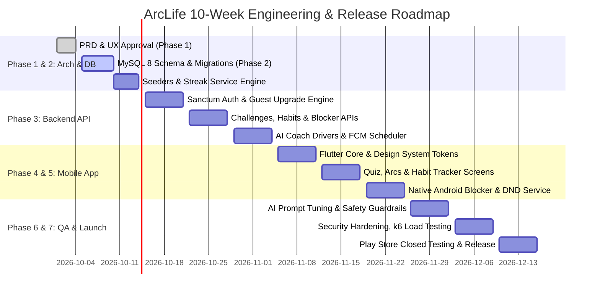

# ArcLife: Product Requirements Document (PRD) & UX Design Specification
**Phase 1 Deliverable — Production-Ready Master Specification**

---

## 1. Product Vision, Target Users & Detailed Personas

### 1.1 Product Vision
**ArcLife** is an open-source, privacy-first, Android-first habit transformation platform engineered to help individuals dismantle self-destructive dopamine loops (doomscrolling, sedentary lifestyles, erratic sleep, fractured focus) and construct high-performance daily operating rhythms. 

By combining structured temporal arcs (**21-Day Habit Builder**, **90-Day Full Transformation**, **Summer Arc**, **Winter Arc**) with native device-level digital detox barriers, culturally nuanced multilingual communication (English + Hindi), and a zero-shame behavioral psychology engine, ArcLife turns aspirational lifestyle shifts into tangible, daily, unbreakable systems.

### 1.2 Target Audience Segments
1. **Competitive Exam & College Students (Ages 17–24, India)**:
   - Candidates preparing for UPSC, JEE, NEET, GATE, CAT, and university finals.
   - Core struggles: Instagram Reels/YouTube Shorts doomscrolling, late-night sleep disruptions, brain fog, anxiety, guilt cycles.
2. **Early-to-Mid Career Working Professionals (Ages 23–35, Metro/Tier-1 Cities)**:
   - Software engineers, consultants, agency leads, corporate workers.
   - Core struggles: Sedentary 10+ hour screen days, chronic back/neck strain, late-night takeout ordering, burnout, weekend recovery paralysis.
3. **Gym & Fitness Novices (Ages 18–32)**:
   - Individuals repeatedly starting fitness initiatives on Mondays or New Year's Day and abandoning them by Day 10 due to friction, lack of progressive micro-habits, and muscle soreness.
4. **Digital-Tethered Youth (Ages 16–28)**:
   - Users clocking 6 to 9+ hours of non-productive daily smartphone screen time, seeking deep focus, dopamine detox, and monk-mode style discipline without toxic, hyper-aggressive influencer shaming.

---

### 1.3 Detailed User Personas

```
+----------------------------------------------------------------------------------------------------+
| PERSONA 1: ARYAN SHARMA (The Overwhelmed Aspirant)                                                 |
+----------------------------------------------------------------------------------------------------+
| Age: 21 | Location: Delhi NCR / Tier 1 | Education: Final Year B.Tech + GATE / Tech Prep          |
| Tech Savvy: High | Devices: Redmi Note 12 Pro (Android 13), Budget Windows Laptop                  |
+----------------------------------------------------------------------------------------------------+
| BIO & ROUTINE:                                                                                     |
| Wakes up at 10:30 AM with instant phone pickup. Spends 45 minutes scrolling Instagram Reels.       |
| Attends lectures or sits at desk with sincere intention to study, but checks WhatsApp/Telegram    |
| every 8 minutes. Sleeps at 2:30 AM after a 2-hour doomscrolling binge.                             |
|                                                                                                    |
| PAIN POINTS:                                                                                       |
| - Chronic "Guilt-Paralysis Cycle": Knows what to study, but dopamine resistance is too high.       |
| - Cannot sustain focus for more than 20 minutes without reaching for the smartphone.               |
| - Past habit apps felt like boring spreadsheets or demanded $10/month subscriptions he can't afford.|
|                                                                                                    |
| MOTIVATORS & TRIGGERS:                                                                             |
| - Resonates strongly with "Winter Arc" discipline content on YouTube/X.                            |
| - Needs hard physical boundaries on distracting apps (Instagram, YouTube, Reddit).                 |
| - Prefers Hinglish/Hindi empathetic guidance over corporate English jargon.                        |
+----------------------------------------------------------------------------------------------------+
```

```
+----------------------------------------------------------------------------------------------------+
| PERSONA 2: PRIYA PATEL (The Burnt-Out Developer)                                                  |
+----------------------------------------------------------------------------------------------------+
| Age: 27 | Location: Bengaluru, Karnataka | Occupation: Software Engineer at Tier-1 MNC            |
| Tech Savvy: Very High | Devices: Samsung Galaxy S23 (Android 14), MacBook Pro (Work)              |
+----------------------------------------------------------------------------------------------------+
| BIO & ROUTINE:                                                                                     |
| High-intensity sprint cycles. Sits stationary from 9:30 AM to 7:30 PM. Relies on 4 cups of coffee. |
| Forgets to drink water; orders Swiggy/Zomato at 10 PM. Skin breakouts and neck stiffness.          |
| Desperately wants a consistent workout routine and evening screen cut-off.                         |
|                                                                                                    |
| PAIN POINTS:                                                                                       |
| - Brain is exhausted by evening; defaults to mindless food-delivery + Netflix consumption.        |
| - Has tried 5+ habit apps (Notion templates, Habitica, Streaks); quits when she breaks a streak   |
|   because the apps reset her to Day 0 and make her feel like a failure.                           |
| - Severe lack of hydration (often < 1L water/day) and zero morning sunlight.                      |
|                                                                                                    |
| MOTIVATORS & TRIGGERS:                                                                             |
| - Wants a "Summer Arc" focus: glowing skin, 3.5L hydration, 8 hours sleep, strength training.     |
| - Needs "Streak Freezes" and "Comeback Mode" so a high-pressure on-call night doesn't erase weeks.  |
| - Values clean Material 3 dark aesthetics, privacy, zero ads, and offline reliability.            |
+----------------------------------------------------------------------------------------------------+
```

```
+----------------------------------------------------------------------------------------------------+
| PERSONA 3: ROHIT VERMA (The Reluctant Fitness Starter)                                            |
+----------------------------------------------------------------------------------------------------+
| Age: 19 | Location: Lucknow, Uttar Pradesh | Occupation: B.Com 2nd Year Student                    |
| Tech Savvy: Moderate | Devices: Realme 11 (Android 13)                                            |
+----------------------------------------------------------------------------------------------------+
| BIO & ROUTINE:                                                                                     |
| Hangs out with friends at local tea stalls; irregular meal patterns. Buys gym membership every     |
| January and quits by January 18 due to severe DOMS (muscle soreness) and intimidating gym bros.    |
| Wants to build physical confidence, posture, and discipline.                                       |
|                                                                                                    |
| PAIN POINTS:                                                                                       |
| - "All-or-Nothing" fallacy: thinks unless he works out 90 minutes daily, it's useless.            |
| - High urge relapses: easily swayed by peer outings, late night gaming, and porn/masturbation loops|
|   that leave him lethargic the next day.                                                           |
| - English-heavy habit apps feel alienating and disconnect from his everyday Indian reality.        |
|                                                                                                    |
| MOTIVATORS & TRIGGERS:                                                                             |
| - Needs simple, progressive micro-steps (e.g., Day 1: just do 10 pushups + drink 2 glasses water). |
| - Native Hindi language UI and motivational nudges ("Bhai, aage badh! Ek din miss hua toh kya"). |
| - Gamified XP, levels, and unlocking badges gives him the dopamine hit he previously got from reels.|
+----------------------------------------------------------------------------------------------------+
```

---

## 2. User Stories (INVEST Format) by Epic

### 2.1 Epic: Authentication & Profile
- **US-AUTH-01 (Guest Mode First)**:
  * *As an* unauthenticated user,
  * *I want to* start using the app immediately as a guest without signing up,
  * *So that* I can evaluate the quiz and habit tools before committing my email.
  * **Acceptance Criteria**:
    - App generates an anonymous UUID device credential saved securely.
    - Full access to local habits, challenges, and blocker.
    - Prominent banner in Settings offers 1-tap Google Sign-In or Email link to retain data.
- **US-AUTH-02 (Seamless Account Upgrade)**:
  * *As a* guest user,
  * *I want to* link my Google Account or Email/Password,
  * *So that* my challenges, streaks, and XP are securely preserved in the cloud without data loss.
  * **Acceptance Criteria**:
    - Backend transfers all `guest_user_id` records to the newly created permanent `user_id` in a single database transaction.
    - Returns valid Laravel Sanctum access token tied to the persistent account.
- **US-AUTH-03 (Token Rotation & Logout)**:
  * *As an* authenticated user,
  * *I want to* stay logged in across app restarts with automatic token rotation,
  * *So that* I do not get repeatedly asked to log in while maintaining security.
- **US-AUTH-04 (Account Deletion & Data Purge)**:
  * *As a* user,
  * *I want to* permanently delete my account and all associated cloud data from the Settings screen,
  * *So that* my personal history is entirely purged in compliance with Google Play and GDPR standards.

### 2.2 Epic: Onboarding & Lifestyle Assessment
- **US-ONB-01 (Interactive Diagnostic Quiz)**:
  * *As a* first-time user,
  * *I want to* answer a 16-question lifestyle assessment with smooth micro-animations,
  * *So that* the app understands my sleep, screen time, physical activity, and discipline baseline.
  * **Acceptance Criteria**:
    - Progress bar updates dynamically (1/16 to 16/16).
    - Can navigate back to alter previous answers.
    - Zero page reloads; instantaneous local state transitions.
- **US-ONB-02 (Diagnostic Roadmap Generation)**:
  * *As a* quiz completer,
  * *I want to* see my quantified "Life Balance Index" and a recommended Challenge Arc,
  * *So that* I receive a personalized, clear starting point rather than choice overload.

### 2.3 Epic: Challenge Engine
- **US-CHL-01 (Enroll in Structured Challenge)**:
  * *As a* user,
  * *I want to* join the 21-Day Habit Builder, 90-Day Transformation, Summer Arc, or Winter Arc,
  * *So that* I receive a daily progressive checklist tailored to that challenge.
  * **Acceptance Criteria**:
    - Stores `user_challenges` record with `start_date`, `status = active`, and generates Day 1 tasks.
    - Syncs tasks to local offline cache (Hive/Isar).
- **US-CHL-02 (Daily Task Execution)**:
  * *As an* enrolled participant,
  * *I want to* check off completed tasks with haptic feedback and celebratory micro-animations,
  * *So that* I feel immediate positive reinforcement for taking action.
- **US-CHL-03 (Rest-Day & Active Recovery Handling)**:
  * *As an* enrolled participant,
  * *I want* scheduled recovery days to offer light restorative tasks without breaking my challenge streak,
  * *So that* I avoid physical and mental burnout.
- **US-CHL-04 (Custom Challenge Creation)**:
  * *As an* advanced user,
  * *I want to* build a custom arc with my chosen duration, task list, and schedule,
  * *So that* I can track domain-specific goals (e.g., Coding Interview Prep, Marathon Training).

### 2.4 Epic: Habit Tracker & Heatmap
- **US-HAB-01 (Daily Habit Check-in & Undo)**:
  * *As a* user,
  * *I want to* toggle a habit complete or undo it within the current 24-hour cycle,
  * *So that* accidental taps can be corrected without corrupting my streak.
- **US-HAB-02 (Calendar Heatmap Visualization)**:
  * *As a* user,
  * *I want to* inspect a GitHub-style annual/monthly heatmap for each habit,
  * *So that* I can visually perceive consistency patterns over 30, 60, and 365 days.

### 2.5 Epic: Digital Detox & Native Blocker
- **US-DTX-01 (App Selection for Blocking)**:
  * *As a* phone-addicted user,
  * *I want to* pick specific distracting apps (e.g., Instagram, YouTube, X, Gaming),
  * *So that* they are actively restricted during my focus windows or challenge duration.
- **US-DTX-02 (Full-Screen Blocking Overlay)**:
  * *As a* user attempting to open a blocked app,
  * *I want* ArcLife to immediately display a motivational full-screen overlay,
  * *So that* my subconscious reflex is interrupted.
- **US-DTX-03 (Emergency Unlock with Delay Barrier)**:
  * *As an* interrupted user in an urgent scenario,
  * *I want an* "Emergency Unlock" option requiring a 30-second friction wait,
  * *So that* genuine emergencies are accommodated while preventing impulsive bypassing.
  * **Acceptance Criteria**:
    - Countdown timer (30s) must run to 0 before unlocking for 5 minutes.
    - Unlock event is logged to `audit_logs` and displays on the weekly detox report.

### 2.6 Epic: AI Coach (Open-Source LLMs)
- **US-AIC-01 (Contextual Daily Motivation)**:
  * *As a* user starting my morning,
  * *I want* a short, punchy 2-sentence motivational tip reflecting my current challenge day and recent streak,
  * *So that* I start the day with focus in my chosen language (English, Hindi, or Hinglish).
- **US-AIC-02 (Empathetic Comeback Coaching)**:
  * *As a* user who missed 2 days,
  * *I want to* chat with the AI coach to analyze what went wrong without feeling judged,
  * *So that* I receive an actionable 48-hour recovery micro-plan.
- **US-AIC-03 (Crisis Safety Fallback)**:
  * *As a* distressed user expressing self-harm or severe crisis keywords,
  * *I want* the AI to immediately surface certified national helpline numbers (KIRAN 1800-599-0019 / Tele-MANAS 14416),
  * *So that* my immediate safety is preserved above all else.

### 2.7 Epic: Gamification & Streaks
- **US-GAM-01 (XP & Level Up)**:
  * *As a* user completing habits and challenges,
  * *I want to* earn XP and progress through 50 distinct discipline ranks,
  * *So that* I have a continuous sense of tangible progression.
- **US-GAM-02 (Streak Freeze Protection)**:
  * *As a* consistent user facing an unexpected travel day or illness,
  * *I want* my earned streak freeze to automatically safeguard my streak,
  * *So that* unavoidable life circumstances do not wipe out weeks of hard work.

### 2.8 Epic: Journal & Mood Tracking
- **US-JRN-01 (Quick Mood & Daily Reflection)**:
  * *As a* user winding down at night,
  * *I want to* log my mood (1–5) and write a 2-minute gratitude/focus entry,
  * *So that* I can reflect on my emotional state and its correlation with habit adherence.
- **US-JRN-02 (Screenshot Protection)**:
  * *As a* privacy-conscious individual,
  * *I want* my journal screen protected against screen captures (`FLAG_SECURE`),
  * *So that* my intimate personal reflections remain private even if someone touches my phone.

---

## 3. Detailed Challenge Design

```
+----------------------------------------------------------------------------------------------------+
| CHALLENGE ARCHITECTURE MATRIX                                                                      |
+----------------------+-----------+-------------------------+---------------------------------------+
| Challenge Name       | Duration  | Core Target             | Mental Model                          |
+----------------------+-----------+-------------------------+---------------------------------------+
| 21-Day Habit Builder | 21 Days   | Habit Loop Inception    | "Cue -> Action -> Reward" Micro-Steps |
| 90-Day Overhaul      | 90 Days   | Identity Transformation | Reset (1-30) -> Build (31-60) -> Lock |
| Summer Arc           | 60 Days   | Vitality & Aesthetics   | Sun, Hydration, Movement, Radiant Skin|
| Winter Arc           | 75 Days   | Monk Mode Discipline    | Cold, Heavy Lifting, Deep Work, Books |
| Custom Arc           | Dynamic   | Personalized Milestones | User-Defined Boundary System          |
+----------------------+-----------+-------------------------+---------------------------------------+
```

### 3.1 21-Day Habit Builder (The Friction Breaker)
* **Goal**: Establish the psychological baseline that building a habit is frictionless when tasks are small.
* **Rules**:
  1. Maximum 3 daily core habits + 1 reflection habit.
  2. Completion window: 05:00 AM to 23:59 PM in user's local timezone.
  3. Every 7th day (Days 7, 14, 21) is an **Active Recovery Day**: physical demands are scaled down to 15-minute gentle mobility/walk + mindful reflection.
* **Daily Task Structure**:
  - `Morning Directive`: Drink 500ml water immediately upon waking + 5 minutes sunlight exposure.
  - `Focus Anchor`: Complete one 25-minute Pomodoro session with phone on Do-Not-Disturb.
  - `Physical Stimulus`: 15 minutes of continuous physical movement (brisk walking, stretching, or bodyweight).
  - `Evening Shutdown`: Put smartphone outside bedroom or enable blocker at 22:30 PM.

### 3.2 90-Day Transformation (The Complete Rebirth)
Divided into 3 distinct psychological phases of 30 days each:

#### Phase 1: The Dopamine Reset (Days 1–30)
* **Objective**: Cleanse receptor fatigue, reset circadian rhythms, eliminate high-friction vices.
* **Weekly Themes**:
  - *Week 1 (Baseline Purge)*: Audit screen time; establish hard cap of 45 minutes social media/day.
  - *Week 2 (Circadian Anchoring)*: Strict sleep window (in bed by 23:00, awake by 07:00). Zero screens 45 min before sleep.
  - *Week 3 (Nutritional Cleanse)*: Zero sugary carbonated beverages; minimum 3 Liters water daily.
  - *Week 4 (Friction Mastery)*: 30 minutes daily brisk walk or gym introduction. Zero doomscrolling in bed.

#### Phase 2: The Kinetic Build (Days 31–60)
* **Objective**: Channel liberated attention into physical strength, clean nutrition, and deep intellectual output.
* **Weekly Themes**:
  - *Week 5 (Progressive Overload)*: 4x weekly resistance or bodyweight training (30-45 minutes).
  - *Week 6 (Cognitive Deep Work)*: 90 minutes of uninterrupted single-tasking daily (phone blocked).
  - *Week 7 (Fuel Integrity)*: 80% whole-food nutrition; prioritize protein and micronutrients.
  - *Week 8 (Mental Fortitude)*: 10 minutes daily breathwork or mindfulness; 10 pages non-fiction reading.

#### Phase 3: The Identity Lock-In (Days 61–90)
* **Objective**: Make the new lifestyle autonomous, effortless, and resilient to social or environmental relapses.
* **Weekly Themes**:
  - *Week 9 (Identity Architecture)*: Reframe self-talk from "I am trying to be healthy" to "I am an athlete/disciplined scholar".
  - *Week 10 (Social Boundary Mastery)*: Confidently decline late-night unproductive binge-drinking and screen marathons.
  - *Week 11 (Monk-Level Consistency)*: Full synchronization of morning routine, deep work blocks, and evening wind-down.
  - *Week 12 (The New Standard)*: Final fitness baseline test, 90-day review, generation of permanent lifestyle charter.

### 3.3 Summer Arc (Vitality, Aesthetics & Sunlight)
* **Core Pillars**:
  1. **Hydration Engine**: 3.5 Liters of water daily tracked via in-app widget.
  2. **Solar Priming**: 15 minutes direct morning sunlight before 08:30 AM (optimizing cortisol & vitamin D).
  3. **Aesthetic Movement**: 45 minutes outdoor cardio, sports, or gym session.
  4. **Barrier Skincare**: Morning: Gentle cleanser + SPF 50 sunscreen. Evening: Hydrating cleanser + moisturizer.
  5. **Clean Fueling**: Seasonal fruits, unprocessed carbohydrates, minimal seed oils.
  6. **Skill Accelerator**: 45 minutes daily deliberate practice on a creative or high-income skill (coding, design, writing).

### 3.4 Winter Arc (Cold Discipline, Monk Mode & Deep Focus)
* **Core Pillars**:
  1. **Pre-Dawn Awakening**: Awake at 05:30 AM (or personal equivalent, 2 hours before main work/class).
  2. **Cold Shower Shock**: 60–120 seconds cold shower upon waking (dopamine elevation without screens).
  3. **Iron Temple**: 45–60 minutes intense strength training or calisthenics 5x/week.
  4. **Deep Work Sanctum**: 2 hours of distraction-free study/work with native app blocker engaged.
  5. **Intellectual Growth**: Read 15 pages of physical books daily.
  6. **Impulse Mastery & Dopamine Moderation (Non-Judgmental)**:
     - Clear mental framework: replacement rather than repression. When high-stimulation urges (doomscrolling, pornography, compulsive snacking) strike, trigger an immediate healthy substitution (15 pushups, a 5-minute cold water face splash, or a 10-minute walk).
     - App language is clinical, supportive, and dignified: focuses on *Vitality Preservation*, *Focus Protection*, and *Dopamine Sensitivity*.

### 3.5 Custom Challenge Builder
Users can configure custom arcs with:
- **Title & Iconography**: Custom name, banner color, motivational motto.
- **Duration**: Flexible choice (7, 14, 30, 45, 60, 90, 180, or 365 days).
- **Daily Tasks (1 to 8 tasks)**: Each with type (`boolean_toggle`, `numeric_target` e.g., 3000ml, `duration_timer` e.g., 45m).
- **Recurrence Pattern**: Everyday, weekdays only, or custom day-of-week mask.
- **Rest Day Policy**: Designate specific days as optional or restorative.

### 3.6 Failure Rules, Streak Freezes & "Comeback Mode"
* **The "Never Miss Twice" Axiom**:
  Missing a single day never resets progress to Day 0. Life happens. The only rule is: *never miss two consecutive days*.
* **Streak Freeze Economy**:
  - Every 7 consecutive days completed earns **1 Streak Freeze** (maximum 2 held in inventory).
  - If a user fails to check in before midnight, a freeze is automatically consumed, preserving the streak count and displaying an empathetic banner: *"Freeze deployed! Your momentum is safe. Let's conquer today."*
* **Comeback Mode (Zero Shame Architecture)**:
  - If a user misses 2 or more consecutive days without freezes, the streak resets to 0, but **their historical XP, badges, and challenge day completion count are NEVER erased**.
  - The UI enters **"Comeback Mode"** for 48 hours:
    1. Replaces red failure alerts with a calm, empowering obsidian/teal card: *"The path is not a straight line. Every master has stumbled. Welcome back."*
    2. Drops daily task intensity by 50% for 2 days (e.g., 10 minutes walking instead of 45 minutes) to break inertia and rebuild neurochemical momentum.
    3. Awards a "Phoenix Comeback" bonus (+50 XP) upon completing the first comeback day.

---

## 4. "Bad Life -> Good Life" Onboarding Diagnostic Quiz

### 4.1 Assessment Structure
The quiz comprises **16 questions** across 4 psychological dimensions (4 questions per dimension). Each response is weighted on a 1-to-4 scale (1 = Severe Friction/Disarray, 4 = Optimal Discipline).

```
Dimension 1: Sleep Architecture & Energy (Q1 - Q4)
Dimension 2: Digital Tether & Attention Span (Q5 - Q8)
Dimension 3: Physical Vitality & Nutrition (Q9 - Q12)
Dimension 4: Mental Discipline & Purpose (Q13 - Q16)
```

### 4.2 Complete Question Bank

#### Dimension 1: Sleep Architecture & Energy
* **Q1. What is the very first thing you do within 5 minutes of waking up?**
  - [A] Grab my phone and scroll social media/reels in bed (Score: 1)
  - [B] Hit snooze multiple times, wake up feeling foggy (Score: 2)
  - [C] Check work messages or email while getting out of bed (Score: 3)
  - [D] Drink water, get out of bed immediately without looking at screens (Score: 4)
* **Q2. How consistent is your sleeping schedule?**
  - [A] Chaotic; sleep varies between 1:00 AM and 4:00 AM every night (Score: 1)
  - [B] Inconsistent; sleep late on weekends, struggle on weekdays (Score: 2)
  - [C] Moderate; sleep around midnight, wake up around 7:30 AM (Score: 3)
  - [D] Strict anchor; in bed and asleep by 22:30–23:00 every single night (Score: 4)
* **Q3. How do your physical energy levels feel at 2:00 PM in the afternoon?**
  - [A] Completely drained; brain fog, desperate for sugar or caffeine (Score: 1)
  - [B] Sluggish; struggle to concentrate on deep tasks (Score: 2)
  - [C] Stable enough to continue routine work (Score: 3)
  - [D] High alertness, crisp cognitive focus, zero crash (Score: 4)
* **Q4. When do you stop looking at illuminated screens before sleeping?**
  - [A] Phone is in my hand right until my eyes shut (Score: 1)
  - [B] Within 15 minutes of sleeping (Score: 2)
  - [C] About 30–45 minutes prior (Score: 3)
  - [D] At least 60 minutes before bed; phone stays outside the bedroom (Score: 4)

#### Dimension 2: Digital Tether & Attention Span
* **Q5. What does your typical daily smartphone screen time look like?**
  - [A] 7+ hours per day, mostly Instagram, YouTube, reels, or gaming (Score: 1)
  - [B] 5 to 7 hours per day (Score: 2)
  - [C] 3 to 5 hours per day (Score: 3)
  - [D] Under 3 hours per day, strictly intentional utility (Score: 4)
* **Q6. When you sit down to study or do complex work, how long before you check your phone?**
  - [A] Less than 10 minutes; I open apps without even realizing it (Score: 1)
  - [B] About 20 to 25 minutes before feeling restless (Score: 2)
  - [C] Around 45 to 60 minutes of uninterrupted work (Score: 3)
  - [D] 90+ minutes of deep flow state without touching devices (Score: 4)
* **Q7. How do you respond to boredom (waiting in a queue, elevator, or traffic)?**
  - [A] Instant phone pull; cannot stand 30 seconds of quiet (Score: 1)
  - [B] Usually take out phone to pass time (Score: 2)
  - [C] Occasionally check phone, but can observe surroundings (Score: 3)
  - [D] Comfortable with stillness; zero urge to consume digital noise (Score: 4)
* **Q8. How frequently do you feel regret or self-criticism after closing social media?**
  - [A] Daily; feeling like hours vanished with nothing to show for it (Score: 1)
  - [B] Several times a week (Score: 2)
  - [C] Rarely; I consume mostly educational or productive media (Score: 3)
  - [D] Never; my digital consumption is completely curated and bounded (Score: 4)

#### Dimension 3: Physical Vitality & Nutrition
* **Q9. How much intentional physical movement/exercise do you get weekly?**
  - [A] Virtually zero; purely sedentary lifestyle (Score: 1)
  - [B] 1 or 2 random walks or irregular workouts per month (Score: 2)
  - [C] 2 to 3 workout sessions or 7,000+ daily steps (Score: 3)
  - [D] 4 to 6 structured workout/sport sessions per week (Score: 4)
* **Q10. What is your daily water consumption pattern?**
  - [A] Less than 1 Liter; only drink when parched (Score: 1)
  - [B] 1 to 2 Liters; forget to hydrate during work (Score: 2)
  - [C] 2 to 3 Liters consistently (Score: 3)
  - [D] 3.5+ Liters daily with electrolytes/hydration tracking (Score: 4)
* **Q11. What best describes your nutritional choices over the past 30 days?**
  - [A] Frequent fast food, late-night ordering, deep-fried snacks, sugary drinks (Score: 1)
  - [B] Home-cooked meals mixed with frequent junk snacking and erratic timing (Score: 2)
  - [C] Balanced home meals, moderate protein, occasional treats (Score: 3)
  - [D] High whole-food density, measured protein, clean hydration, zero junk (Score: 4)
* **Q12. How much direct outdoor sunlight hits your eyes in the morning?**
  - [A] Zero; stay indoors under artificial LED lighting all day (Score: 1)
  - [B] Less than 5 minutes during daily commute (Score: 2)
  - [C] 10 to 15 minutes most mornings (Score: 3)
  - [D] 20+ minutes of morning outdoor exposure daily (Score: 4)

#### Dimension 4: Mental Discipline & Purpose
* **Q13. When you make a commitment to yourself (e.g., "Starting Monday"), what happens?**
  - [A] I break it within 3 days and feel demoralized (Score: 1)
  - [B] I last about a week, then drop off when friction appears (Score: 2)
  - [C] I maintain it for 2 to 3 weeks before losing steam (Score: 3)
  - [D] I follow through consistently, adapting when schedule changes (Score: 4)
* **Q14. How do you handle high-dopamine urges (scrolling, junk food, adult content)?**
  - [A] Immediate surrender; almost zero impulse resistance (Score: 1)
  - [B] Resist briefly, but give in after a short mental debate (Score: 2)
  - [C] Can redirect urges about 60% of the time (Score: 3)
  - [D] Complete emotional control; high mastery over dopamine impulses (Score: 4)
* **Q15. How many pages of non-fiction or educational literature do you read weekly?**
  - [A] Zero pages; haven't read a book in months/years (Score: 1)
  - [B] Skim articles or Twitter threads, but no books (Score: 2)
  - [C] Read 10 to 25 pages per week (Score: 3)
  - [D] 50+ pages per week consistently (Score: 4)
* **Q16. How clear are your 90-day personal and professional goals right now?**
  - [A] Completely unclear; feeling lost and floating day to day (Score: 1)
  - [B] Vague ideas in my head, but nothing written or tracked (Score: 2)
  - [C] General milestones identified, but execution is inconsistent (Score: 3)
  - [D] Crystal clear, written, reviewed weekly, and broken into daily actions (Score: 4)

---

### 4.3 Scoring Formula & Lifestyle Tier Output

#### Formula
$$\text{Total Score } S = \sum_{i=1}^{16} Q_i \quad (\text{Range: } 16 \text{ to } 64)$$
$$\text{Dimension Scores: } D_{\text{sleep}} = \sum_{i=1}^{4} Q_i, \quad D_{\text{digital}} = \sum_{i=5}^{8} Q_i, \quad D_{\text{physical}} = \sum_{i=9}^{12} Q_i, \quad D_{\text{discipline}} = \sum_{i=13}^{16} Q_i \quad (\text{Each: } 4 \text{ to } 16)$$
$$\text{Life Balance Index } (\%) = \left(\frac{S - 16}{48}\right) \times 100$$

#### Scoring Tiers & Roadmap Assignment
```
+---------------------------------------------------------------------------------------------------------+
| SCORING CLASSIFICATION & ROADMAP GENERATION TABLE                                                       |
+------------+-------------+---------------------------+--------------------------------------------------+
| Score Range| Index Tier  | Diagnostic Archetype      | Recommended Personalized Roadmap                 |
+------------+-------------+---------------------------+--------------------------------------------------+
| 16 – 27    | Tier 1 (<25%)| "Dopamine Burnout"        | 21-Day Habit Builder (Gentle Reset Track)        |
|            |             | Critical digital overload | Focus: Sleep anchor, 1L water AM, phone blocker. |
+------------+-------------+---------------------------+--------------------------------------------------+
| 28 – 39    | Tier 2 (25-49)| "Inconsistent Seeker"   | 21-Day Habit Builder -> 90-Day Transition        |
|            |             | High friction, boom-bust  | Focus: 25m Pomodoro, 15m walk, evening shutdown. |
+------------+-------------+---------------------------+--------------------------------------------------+
| 40 – 51    | Tier 3 (50-74)| "Emerging Performer"    | Summer Arc or 90-Day Transformation              |
|            |             | Decent habits, plateaud   | Focus: Aesthetics, 3.5L hydration, deep study.   |
+------------+-------------+---------------------------+--------------------------------------------------+
| 52 – 64    | Tier 4 (75%+)| "Discipline Warrior"      | Winter Arc (Monk Mode Track)                     |
|            |             | High base, seeks mastery  | Focus: 05:30 AM wake, cold shower, 2h deep work. |
+------------+-------------+---------------------------+--------------------------------------------------+
```

---

## 5. Full Screen Inventory

```
+----+----------------------+------------------------------------------+-----------------------+-----------------------+---------------------+
| #  | Screen Name          | Core Purpose                             | Key UI Components     | Navigation In / Out   | Empty / Error States|
+----+----------------------+------------------------------------------+-----------------------+-----------------------+---------------------+
| 01 | Splash Screen        | App cold start, token check, route router| Animated ArcLogo,     | In: App Launch        | Error: Corrupt local|
|    |                      |                                          | version, loading spinner| Out: Auth/Home/Quiz  | storage -> Reset.   |
+----+----------------------+------------------------------------------+-----------------------+-----------------------+---------------------+
| 02 | Onboarding Carousel  | Pitch 3 value propositions (Arcs, Detox) | 3 swipeable cards,    | In: Splash (First run)| N/A (Static asset   |
|    |                      |                                          | dots indicator, Next  | Out: Quiz or Auth     | content).           |
+----+----------------------+------------------------------------------+-----------------------+-----------------------+---------------------+
| 03 | Auth Landing         | Sign in with Google, Email, or Guest mode| Google Button, Email  | In: Onboarding/Setting| Error: Snackbar     |
|    |                      |                                          | form, "Continue Guest"| Out: Quiz or Home     | with retry trigger. |
+----+----------------------+------------------------------------------+-----------------------+-----------------------+---------------------+
| 04 | Diagnostic Quiz      | 16-question lifestyle assessment         | Question card, 4 pills| In: Auth / Onboarding | Error: Save state   |
|    |                      |                                          | back button, progress | Out: Roadmap Result   | locally if network  |
+----+----------------------+------------------------------------------+-----------------------+-----------------------+---------------------+
| 05 | Roadmap Result       | Reveal Life Index % & Recommended Arc    | Radar chart, score,   | In: Quiz Completion   | Loading: 2s sleek   |
|    |                      |                                          | Arc summary, "Begin"  | Out: Home Dashboard   | diagnostic analysis.|
+----+----------------------+------------------------------------------+-----------------------+-----------------------+---------------------+
| 06 | Home Dashboard       | Primary daily cockpit for active day     | Streak Flame, Arc Day,| In: Main Tab 1        | Empty: "No active   |
|    |                      |                                          | Task checklist, Stats | Out: Task Detail, AIC | challenge. Join one"|
+----+----------------------+------------------------------------------+-----------------------+-----------------------+---------------------+
| 07 | Challenge Catalog    | Browse 21-Day, 90-Day, Summer, Winter Arc| Arc Hero Cards, tags, | In: Main Tab 2        | Empty: Filter zero  |
|    |                      |                                          | difficulty, "+ Custom"| Out: Challenge Detail | results state.      |
+----+----------------------+------------------------------------------+-----------------------+-----------------------+---------------------+
| 08 | Challenge Detail     | Deep dive into arc rules & curriculum    | Timeline preview, FAQ,| In: Catalog           | Error: Failed to    |
|    |                      |                                          | enrolled stats, "Join"| Out: Home (Active Arc)| fetch template.     |
+----+----------------------+------------------------------------------+-----------------------+-----------------------+---------------------+
| 09 | Today's Task Detail  | Check in task with note/timer/metrics    | Task description,     | In: Home Checklist    | Error: Local sync   |
|    |                      |                                          | timer, complete button| Out: Back to Home     | retry button.       |
+----+----------------------+------------------------------------------+-----------------------+-----------------------+---------------------+
| 10 | Habit Tracker Heatmap| Standalone micro-habits & annual heatmaps| GitHub-style heatmaps,| In: Main Tab 3        | Empty: "No habits   |
|    |                      |                                          | streak counters, logs | Out: Habit Editor     | created yet."       |
+----+----------------------+------------------------------------------+-----------------------+-----------------------+---------------------+
| 11 | Digital Detox Blocker| Native app blocker configuration         | App toggle list, focus| In: Main Tab 4        | Empty: "No apps     |
|    |                      |                                          | schedule, 30s unlock  | Out: Permission Guide | selected to block." |
+----+----------------------+------------------------------------------+-----------------------+-----------------------+---------------------+
| 12 | Blocker Overlay      | Native Android full-screen block screen  | Stoic quote, app name,| In: Native Service    | N/A (Pure offline   |
|    | (Native Activity)    |                                          | 30s unlock button     | Out: Home or Launcher | native view).       |
+----+----------------------+------------------------------------------+-----------------------+-----------------------+---------------------+
| 13 | Focus Session        | Native Pomodoro / Deep Work timer        | Circular timer, DND   | In: Home / Blocker    | Background sync     |
|    | (Pomodoro)           |                                          | status, pause, stop   | Out: Session Summary  | persistent notif.   |
+----+----------------------+------------------------------------------+-----------------------+-----------------------+---------------------+
| 14 | Usage Stats Screen   | Screen time, unlocks, pickups analytics  | Bar charts (fl_chart),| In: Blocker / Settings| Empty: "Usage stats |
|    |                      |                                          | app breakdown table   | Out: App Detail       | permission needed." |
+----+----------------------+------------------------------------------+-----------------------+-----------------------+---------------------+
| 15 | AI Coach Chat        | Conversational coach & comeback support  | Message thread, audio | In: Floating Action   | Loading: Typing dot |
|    |                      |                                          | toggle, input bar     | Out: Home             | Error: Offline badge|
+----+----------------------+------------------------------------------+-----------------------+-----------------------+---------------------+
| 16 | Journal & Mood       | Daily evening reflection & mood rating   | 5-star mood selector, | In: Home / Profile    | Empty: "First day.  |
|    |                      |                                          | rich text box, lock   | Out: Journal History  | Write your thoughts"|
+----+----------------------+------------------------------------------+-----------------------+-----------------------+---------------------+
| 17 | Badges & Gamification| XP level curve, 30 unlockable badges     | Level bar, Bronze/Gold| In: Profile / Home    | Empty: Unearned     |
|    |                      |                                          | badges, leaderboards  | Out: Badge Detail     | badges grayed out.  |
+----+----------------------+------------------------------------------+-----------------------+-----------------------+---------------------+
| 18 | Settings & Privacy   | App settings, language, GDPR data export | Language (EN/HI), Dark| In: Profile Settings  | Error: Network fail |
|    |                      |                                          | toggle, Export, Delete| Out: Auth (on delete) | for cloud export.   |
+----+----------------------+------------------------------------------+-----------------------+-----------------------+---------------------+
```

---

## 6. Text Wireframes (12 Essential Screens)

### 6.1 Screen 03: Auth Landing (Clean, Low Friction)
```text
+-------------------------------------------------------+
|  09:41                   [⚡ ArcLife]          88% 🔋 |
+-------------------------------------------------------+
|                                                       |
|                     [⚡ ARC ICON]                     |
|                                                       |
|                       ArcLife                         |
|             "Master Your Mind. Own Your Day."         |
|                                                       |
|   +-----------------------------------------------+   |
|   |  [G]  Continue with Google                    |   |
|   +-----------------------------------------------+   |
|                                                       |
|                         - OR -                        |
|                                                       |
|   +-----------------------------------------------+   |
|   |  Email Address                                |   |
|   +-----------------------------------------------+   |
|   +-----------------------------------------------+   |
|   |  Password                                     |   |
|   +-----------------------------------------------+   |
|                                                       |
|   +-----------------------------------------------+   |
|   |                 Sign In / Register            |   |
|   +-----------------------------------------------+   |
|                                                       |
|   -------------------------------------------------   |
|        [>> Continue as Guest (Evaluate App)]          |
|   -------------------------------------------------   |
|                                                       |
|   By continuing, you agree to 100% Privacy & Zero Ads |
+-------------------------------------------------------+
```

### 6.2 Screen 04: Diagnostic Quiz (Step 3/16)
```text
+-------------------------------------------------------+
|  <- Back              Step 03 of 16            Skip > |
|  [======================----------------------------] |
+-------------------------------------------------------+
|                                                       |
|  SECTION: SLEEP ARCHITECTURE                          |
|                                                       |
|  How do your physical energy levels feel              |
|  at 2:00 PM in the afternoon?                         |
|                                                       |
|  +-------------------------------------------------+  |
|  | ( ) Completely drained; severe brain fog        |  |
|  +-------------------------------------------------+  |
|  +-------------------------------------------------+  |
|  | ( ) Sluggish; struggle to do deep focus work    |  |
|  +-------------------------------------------------+  |
|  +-------------------------------------------------+  |
|  | (o) Moderate; can do routine work fine          |  |
|  +-------------------------------------------------+  |
|  +-------------------------------------------------+  |
|  | ( ) High alertness, crisp cognitive focus       |  |
|  +-------------------------------------------------+  |
|                                                       |
|                                                       |
|  +-------------------------------------------------+  |
|  |                   Next Question ->              |  |
|  +-------------------------------------------------+  |
+-------------------------------------------------------+
```

### 6.3 Screen 05: Roadmap Reveal & Life Index Result
```text
+-------------------------------------------------------+
|  09:41                                         88% 🔋 |
+-------------------------------------------------------+
|                YOUR LIFESTYLE DIAGNOSTIC              |
|                                                       |
|                     +-----------+                     |
|                     |    34%    |                     |
|                     | LIFE INDEX|                     |
|                     +-----------+                     |
|            Archetype: Inconsistent Seeker             |
|                                                       |
|   DIMENSION BREAKDOWN:                                |
|   - Sleep & Energy       : [====------] 42%           |
|   - Digital Detox        : [==--------] 20% (CRITICAL)|
|   - Physical Vitality    : [===-------] 30%           |
|   - Mental Discipline    : [=====-----] 50%           |
|                                                       |
|   RECOMMENDED ROADMAP:                                |
|   +-----------------------------------------------+   |
|   |  ⚡ 21-DAY HABIT BUILDER (MOMENTUM TRACK)     |   |
|   |  - Reset morning dopamine loops               |   |
|   |  - Block Instagram/Shorts during focus hours  |   |
|   |  - 3.0L daily hydration + 25m Pomodoro daily  |   |
|   +-----------------------------------------------+   |
|                                                       |
|   +-----------------------------------------------+   |
|   |        [🚀 Begin Your 21-Day Arc Now]         |   |
|   +-----------------------------------------------+   |
+-------------------------------------------------------+
```

### 6.4 Screen 06: Home Dashboard (Day 07 Active Arc)
```text
+-------------------------------------------------------+
|  09:41                 ArcLife             [🔔] [⚙️]  |
+-------------------------------------------------------+
|  WINTER ARC ❄️                      DAY 07 OF 75      |
|  [==================================----------------] |
|                                                       |
|  +---------------------+   +------------------------+ |
|  |  🔥 7 DAYS STREAK   |   |  🛡️ 2 FREEZES ACTIVE   | |
|  |  Level 4: Initiate  |   |  1,420 XP Total        | |
|  +---------------------+   +------------------------+ |
|                                                       |
|  TODAY'S MISSIONS (3/4 Done)           [+ Custom Task]|
|  +--------------------------------------------------+ |
|  | [X] 05:30 AM Pre-Dawn Awakening            +20 XP| |
|  |     Completed at 05:32 AM                        | |
|  +--------------------------------------------------+ |
|  | [X] 60s Cold Shower Shock                  +25 XP| |
|  |     Completed at 05:45 AM                        | |
|  +--------------------------------------------------+ |
|  | [X] 45m Gym / Heavy Resistance             +50 XP| |
|  |     Completed at 07:15 AM                        | |
|  +--------------------------------------------------+ |
|  | [ ] 2h Deep Work Session (Blocker Engaged) +50 XP| |
|  |     [ START 2H FOCUS TIMER -> ]                  | |
|  +--------------------------------------------------+ |
|                                                       |
|  AI COACH TIP: "7-day mark reached. Your dopamine     |
|  baseline is stabilizing. Do not negotiate with urges."|
+-------------------------------------------------------+
|  [🏠 Home]    [🏆 Arcs]    [📊 Habits]    [🔒 Detox]  |
+-------------------------------------------------------+
```

### 6.5 Screen 08: Challenge Detail (Winter Arc)
```text
+-------------------------------------------------------+
|  <- Back              WINTER ARC              [Share] |
+-------------------------------------------------------+
|  [================ HERO IMAGE / BANNER ==============]|
|  ❄️ THE WINTER ARC: 75 DAYS OF MONK DISCIPLINE        |
|  "When the world slows down, the relentless pull away"|
+-------------------------------------------------------+
|  Duration: 75 Days   | Difficulty: Hardcore  | Free   |
|  Active Enrollees: 14,820 warriors                    |
|                                                       |
|  CORE PILLARS:                                        |
|  1. 05:30 AM Wake-Up (No Snooze)                      |
|  2. 60s Cold Shower Shock                             |
|  3. 45m Weight Training / Calisthenics                |
|  4. 2h Pure Deep Work (Distraction-Free)              |
|  5. 15 Pages Physical Book Reading                    |
|  6. Non-Judgmental Urge Redirection                   |
|                                                       |
|  FAILURE PROTOCOL:                                    |
|  - Automatic Freeze deployment on 1 missed day        |
|  - Never Miss Twice Rule: Comeback Mode after 2 misses|
|                                                       |
|  +--------------------------------------------------+ |
|  |           [⚔️ Join This Arc (Start Today)]        | |
|  +--------------------------------------------------+ |
+-------------------------------------------------------+
```

### 6.6 Screen 10: Habit Tracker & Annual Heatmap
```text
+-------------------------------------------------------+
|  09:41                Habit Tracker           [+ Add] |
+-------------------------------------------------------+
|  HABIT: 3.5L Daily Hydration                          |
|  Current Streak: 24 Days | Longest: 31 Days           |
|                                                       |
|  OCTOBER 2026 CONSISTENCY HEATMAP:                    |
|  M  T  W  T  F  S  S                                  |
|  ■  ■  ■  ■  ■  ■  ■   Week 1 (100%)                  |
|  ■  ■  ■  ■  ■  □  ■   Week 2 (85%)                   |
|  ■  ■  ■  ■  ■  ■  ■   Week 3 (100%)                  |
|  ■  ■  ■  ■  ·  ·  ·   Week 4 (In Progress)           |
|  Legend: □ Missed  ■ Completed  · Upcoming            |
|                                                       |
|  ALL ACTIVE HABITS:                                   |
|  +--------------------------------------------------+ |
|  | [X] 3.5L Water Intake             🔥 24d [Undo]  | |
|  +--------------------------------------------------+ |
|  | [X] 15m Morning Sun Exposure      🔥 18d [Undo]  | |
|  +--------------------------------------------------+ |
|  | [ ] 10 Pages Reading              🔥 09d [Check] | |
|  +--------------------------------------------------+ |
|  | [ ] No Phone in Bed at Night      🔥 14d [Check] | |
|  +--------------------------------------------------+ |
+-------------------------------------------------------+
|  [🏠 Home]    [🏆 Arcs]    [📊 Habits]    [🔒 Detox]  |
+-------------------------------------------------------+
```

### 6.7 Screen 11: Digital Detox & Blocker Setup
```text
+-------------------------------------------------------+
|  09:41                App Blocker             [Help]  |
+-------------------------------------------------------+
|  BLOCKER ENGINE: [ ACTIVE 🟢 ]                        |
|  Accessibility Safe • UsageStats Powered              |
|                                                       |
|  FOCUS SCHEDULE:                                      |
|  Active Window: 09:00 AM - 01:00 PM & 02:00 - 06:00 PM|
|                                                       |
|  BLOCKED APPS (4 Selected):                           |
|  +--------------------------------------------------+ |
|  | [X] Instagram                Daily Limit: 0m     | |
|  +--------------------------------------------------+ |
|  | [X] YouTube (Shorts Blocked) Daily Limit: 30m    | |
|  +--------------------------------------------------+ |
|  | [X] X (Twitter)              Daily Limit: 0m     | |
|  +--------------------------------------------------+ |
|  | [X] BGMI / Mobile Gaming     Daily Limit: 0m     | |
|  +--------------------------------------------------+ |
|  | [ ] Reddit                   [ Tap to Add ]      | |
|  +--------------------------------------------------+ |
|                                                       |
|  STRICTNESS SETTINGS:                                 |
|  - Emergency Unlock Delay: [ 30 Seconds ]             |
|  - DND Interruption Filter: [ Auto-Enable ]           |
|                                                       |
|  +--------------------------------------------------+ |
|  |            [⚡ Start 60m Focus Sprint]            | |
|  +--------------------------------------------------+ |
+-------------------------------------------------------+
```

### 6.8 Screen 12: Native Blocker Overlay (App Interception)
```text
+-------------------------------------------------------+
|                                                       |
|                     🛑 HOLD ON                        |
|                                                       |
|               Instagram is currently blocked          |
|                                                       |
|        "You don't need another 30-second reel.        |
|         You need 30 minutes of focused execution."    |
|                                                       |
|                   Session ends in: 42m                |
|                                                       |
|     +-------------------------------------------+     |
|     |     [<- Return to Deep Work (Recommended)]|     |
|     +-------------------------------------------+     |
|                                                       |
|                                                       |
|     [⚠️ Emergency Unlock (Requires 30s Wait)]         |
|                                                       |
|      (Unlocking logs an interruption in your stats)   |
+-------------------------------------------------------+
```

### 6.9 Screen 13: Focus Mode / Pomodoro Timer
```text
+-------------------------------------------------------+
|  <- Back               FOCUS MODE             [Audio] |
+-------------------------------------------------------+
|                                                       |
|                   DEEP WORK BLOCK                     |
|                Winter Arc: Task #4                    |
|                                                       |
|                     //==============\\                |
|                    ||     42:18      ||               |
|                    ||   REMAINING    ||               |
|                     \\==============//                |
|                                                       |
|                 Target: 90 Minutes Total              |
|                                                       |
|    DND Status: ENABLED 🔕                             |
|    Distracting Apps: HARD BLOCKED 🔒                  |
|                                                       |
|    +--------------------+    +--------------------+   |
|    |    [ || Pause ]    |    |   [ ■ End Session] |   |
|    +--------------------+    +--------------------+   |
|                                                       |
|    Background Sound: [ Rain Ambience 🌧️ ]            |
+-------------------------------------------------------+
```

### 6.10 Screen 15: AI Coach Chat (Multilingual & Supportive)
```text
+-------------------------------------------------------+
|  <- Back              AI COACH (Llama 3.3)    [Clear] |
+-------------------------------------------------------+
|  [🤖 AI Coach]: Namaste Aryan! Day 7 of Winter Arc is |
|  huge. You already completed your 05:30 AM wake-up    |
|  and cold shower. How is your focus block going?      |
|                                                       |
|  [Aryan]: Bhai focus ho nahi raha. YouTube dekhne ka  |
|  bohot mann kar raha hai. Lag raha hai quit kardu.    |
|                                                       |
|  [🤖 AI Coach]: Bilkul normal hai bhai. Ye tumhara     |
|  brain dopamine maang raha hai kyunki pichle 6 din me |
|  tumne use cheap stimulation nahi di.                 |
|                                                       |
|  Quit mat karo. Bas 5 deep breaths lo aur 1 glass      |
|  paani piyo. Let's start just a 15-minute micro timer.|
|  I will hold you accountable. Ready?                  |
|                                                       |
+-------------------------------------------------------+
|  [ Type in Hindi, Hinglish, or English...   ] [Send >]|
+-------------------------------------------------------+
```

### 6.11 Screen 16: Journal & Evening Reflection
```text
+-------------------------------------------------------+
|  <- Back             DAILY JOURNAL            [Save]  |
|  October 01, 2026                        [🔒 Encrypted|
+-------------------------------------------------------+
|  HOW WAS YOUR ENERGY & MOOD TODAY?                    |
|  [ 😞 1 ]  [ 😐 2 ]  [ 🙂 3 ]  [ 😃 4 ]  [ 🔥 5 (Peak)]|
|                                                       |
|  PROMPT: What was your greatest win against friction? |
|  +--------------------------------------------------+ |
|  | Woke up at 5:30 AM even though it was freezing.  | |
|  | Felt the urge to browse reels around 3 PM, but   | |
|  | used the 30s blocker barrier and drank water.     | |
|  | Finished my full 2 hours of GATE syllabus.        | |
|  | Feeling proud and clear-headed.                   | |
|  +--------------------------------------------------+ |
|                                                       |
|  TAGS: [#Discipline] [#WinterArc] [#DeepWork]         |
|                                                       |
|  🛡️ Screenshot Protection Active (FLAG_SECURE)        |
+-------------------------------------------------------+
```

### 6.12 Screen 17: Gamification, Badges & XP Profile
```text
+-------------------------------------------------------+
|  09:41                DISCIPLINE PROFILE       [Rank] |
+-------------------------------------------------------+
|  [ 🥋 ARYAN SHARMA ]               LEVEL 07: TITAN    |
|  Total XP: 2,850 / 3,400 XP                           |
|  [======================================------------] |
|                                                       |
|  STREAK RECORDS:                                      |
|  🔥 Active Streak: 7 Days   | 🏆 Best: 21 Days        |
|  🛡️ Freezes Left: 2        | ⏱️ Focus Time: 34.5 Hrs |
|                                                       |
|  BADGES (12 of 30 Unlocked)              [View All >] |
|  +-----------+  +-----------+  +-----------+          |
|  |    ❄️     |  |    🔥     |  |    🛡️     |          |
|  | Winter-07 |  |  7D Iron  |  | Digital   |          |
|  | (Unlocked)|  | (Unlocked)|  | Detox Master         |
|  +-----------+  +-----------+  +-----------+          |
|  +-----------+  +-----------+  +-----------+          |
|  |    🌅     |  |    🧠     |  |    👑     |          |
|  | Dawn Club |  | Deep 50H  |  | Arc King  |          |
|  | (Unlocked)|  | [LOCKED]  |  | [LOCKED]  |          |
|  +-----------+  +-----------+  +-----------+          |
+-------------------------------------------------------+
|  [🏠 Home]    [🏆 Arcs]    [📊 Habits]    [🔒 Detox]  |
+-------------------------------------------------------+
```

---

## 7. Design System

### 7.1 Philosophy & Theme Modes
ArcLife adopts a **Dark-First Motivational Theme** with a zero-glare, obsidian background engineered to minimize eye strain and blue light exposure during evening sessions, complemented by an accessible, crisp **Light Mode**.

### 7.2 Color Palette Tokens

```
+-----------------------------------------------------------------------------------------------+
| ARCLIFE DESIGN TOKENS (MATERIAL 3 HARMONIZED)                                                 |
+-------------------------+--------------------+--------------------+---------------------------+
| Role Token              | Dark Mode (Hex)    | Light Mode (Hex)   | Semantic Purpose          |
+-------------------------+--------------------+--------------------+---------------------------+
| bg-primary              | #0B0E14 (Obsidian) | #F8FAFC (Paper)    | Main application canvas   |
| bg-surface              | #121824 (Charcoal) | #FFFFFF (Pure Wht) | Cards, bottom sheets      |
| bg-surface-container    | #1A2234 (Deep Slate| #EDF2F7 (Light Gld)| Elevated cards, dialogues |
| brand-primary           | #FF6B00 (Arc Flame)| #E05A00 (Deep Fire)| Primary CTAs, active days |
| brand-primary-glow      | #FF8A34 (Amber Glo)| #FF9F59 (Soft Amb) | Highlights, streak flames |
| brand-secondary         | #00E5FF (Electric) | #0099B8 (Teal Blue)| Secondary badges, focus   |
| accent-success          | #00E676 (Growth)   | #00A34D (Emerald)  | Habit completed, verified |
| accent-warning          | #FFB300 (Caution)  | #D9822B (Ochre)    | Streak freeze, alert      |
| accent-error            | #FF3D71 (Crimson)  | #D32F2F (Deep Red) | Emergency unlock, critical|
| text-high-emphasis      | #F8FAFC (95% White)| #0F172A (Deep Slate| Headers, primary body     |
| text-medium-emphasis    | #94A3B8 (Slate 400)| #475569 (Slate 600)| Subtitles, timestamps     |
| text-disabled           | #475569 (Slate 600)| #94A3B8 (Slate 400)| Inactive icons, borders   |
| border-subtle           | #1E293B (Border Drk| #E2E8F0 (Border Lgt| 1px structural outlines   |
+-------------------------+--------------------+--------------------+---------------------------+
```

### 7.3 Typography Scale (`Plus Jakarta Sans` / `Inter`)
- **Display Large**: 57sp / Line-height: 64sp / Weight: 800 (Bold numbers, big counters)
- **Headline Large**: 32sp / Line-height: 40sp / Weight: 700 (Screen titles, Arc names)
- **Headline Medium**: 28sp / Line-height: 36sp / Weight: 600 (Card titles)
- **Title Medium**: 18sp / Line-height: 24sp / Weight: 600 (Task headers, modal titles)
- **Body Large**: 16sp / Line-height: 24sp / Weight: 400 (Descriptions, chat text)
- **Body Medium**: 14sp / Line-height: 20sp / Weight: 400 (Subtext, guidelines)
- **Label Large**: 14sp / Line-height: 20sp / Weight: 600 (Button labels, badge chips)
- **Label Small**: 11sp / Line-height: 16sp / Weight: 500 (Timestamps, XP tags)

### 7.4 Spacing & Border Radius Tokens
- **Spacing Grid**: $4\text{px}$ base grid $\rightarrow$ 4, 8, 12, 16, 24, 32, 48, 64px.
- **Border Radius**:
  - `radius-xs`: 4px (micro badges, tags)
  - `radius-sm`: 8px (input fields, checklist checkmarks)
  - `radius-md`: 12px (task cards, dialogs)
  - `radius-lg`: 20px (large challenge hero cards)
  - `radius-pill`: 999px (action buttons, filter pills)

### 7.5 Animation Guidelines
- **Spring Curves**: Use `Curves.easeOutCubic` (250ms) for sheet entrances; `Curves.elasticOut` (500ms) for check-in completions.
- **Particle System**: Lightweight Confetti burst (`confetti` package) upon marking all daily missions complete.
- **Streak Flame**: Subtle breathing pulse effect (scale 1.0 to 1.08 over 2000ms loop) on the Home Dashboard flame counter.
- **Haptic Feedback**:
  - Task Completed: Medium impact `HapticFeedback.mediumImpact()`.
  - Emergency Unlock initiated: Heavy warning vibration `HapticFeedback.heavyImpact()`.
  - Habit Untoggled: Light tick `HapticFeedback.lightImpact()`.

---

## 8. Notification Strategy & Copywriting

### 8.1 Cadence, Frequency Caps & Quiet Hours
* **Daily Hard Cap**: Maximum **3 push notifications per user per 24 hours**.
* **Quiet Hours**: Hard blackout between **22:30 PM and 06:30 AM** (local timezone) unless the user specifically configures a 05:30 AM wake-up alarm mission.
* **Notification Categorization**:
  1. `Morning Kick-Off` (Scheduled at user's designated wake-up time).
  2. `Mid-Day Anchor` (Scheduled at 14:00 PM: hydration, deep work check).
  3. `Evening Reflection & Streak Guard` (Scheduled at 20:30 PM: tasks pending, streak at risk).

---

### 8.2 Twenty Production Notification Messages (English & Hindi)

#### Category 1: Morning Kick-Off (4 Messages)
1. **EN**: *"Rise and execute. Day {day} of {challenge} has begun. No negotiations."*  
   **HI**: *"उठो और शुरू करो। {challenge} का Day {day} शुरू हो चुका है। कोई बहाना नहीं।"*
2. **EN**: *"The morning sets the tone for the entire day. Hydrate, get sunlight, and take ground."*  
   **HI**: *"सुबह ही तय करती है कि आपका पूरा दिन कैसा होगा। पानी पिएं, धूप लें और शुरुआत करें।"*
3. **EN**: *"Your future self is built in the next 12 hours. Step into the arena."*  
   **HI**: *"आपका आने वाला कल अगले 12 घंटों में बनता है। मैदान में उतरिए।"*
4. **EN**: *"05:30 AM. While the world sleeps, warriors build. Conquer your first task."*  
   **HI**: *"सुबह 5:30 बजे। जब दुनिया सो रही है, तब संकल्प मजबूत होते हैं। पहला टास्क पूरा करें।"*

#### Category 2: Midday Anchor & Hydration (4 Messages)
5. **EN**: *"Pause for 30 seconds. Drink a tall glass of water and reset your posture."*  
   **HI**: *"30 सेकंड रुकें। एक बड़ा गिलास पानी पिएं और अपनी मुद्रा सीधी करें।"*
6. **EN**: *"Midday check: Are you controlling your phone, or is your phone controlling you?"*  
   **HI**: *"दोपहर का सवाल: क्या आप अपने फोन को नियंत्रित कर रहे हैं, या फोन आपको?"*
7. **EN**: *"Afternoon energy dip? Don't reach for reels. Stand up, stretch, take 5 deep breaths."*  
   **HI**: *"थकान लग रही है? रील्स मत खोलिए। खड़े हों, स्ट्रेच करें और 5 गहरी सांसें लें।"*
8. **EN**: *"2 tasks completed, 2 remaining. Finish strong before evening rolls in."*  
   **HI**: *"2 टास्क पूरे हो चुके हैं, 2 बाकी हैं। शाम होने से पहले इन्हें खत्म करें।"*

#### Category 3: Evening Reflection & Wind-Down (4 Messages)
9. **EN**: *"Day {day} is wrapping up. Take 2 minutes to log your journal and claim your XP."*  
   **HI**: *"दिन {day} समाप्त हो रहा है। 2 मिनट निकालें, जर्नल लिखें और अपना XP हासिल करें।"*
10. **EN**: *"Put the digital world to rest. Shut off screens 45 minutes before sleep for deep recovery."*  
    **HI**: *"डिजिटल दुनिया को विराम दें। गहरी नींद और रिकवरी के लिए सोने से 45 मिनट पहले स्क्रीन बंद करें।"*
11. **EN**: *"How was your battle with friction today? Reflect, log your mood, and recharge."*  
    **HI**: *"आज की चुनौतियों से आपकी जंग कैसी रही? आत्मचिंतन करें, मूड दर्ज करें और आराम करें।"*
12. **EN**: *"Victory is won one consistent night at a time. Sleep well, warrior."*  
    **HI**: *"हर अनुशासित रात ही कल की जीत तय करती है। अच्छी नींद लें।"*

#### Category 4: Streak Protection & Risk Alerts (4 Messages)
13. **EN**: *"⚠️ Your {streak}-day streak is at risk! Complete your last mission before midnight."*  
    **HI**: *"⚠️ आपकी {streak} दिनों की स्ट्रीक खतरे में है! आधी रात से पहले अपना आखिरी टास्क पूरा करें।"*
14. **EN**: *"Don't drop the sword at 11 PM. One quick check-in saves weeks of hard work."*  
    **HI**: *"रात 11 बजे हिम्मत मत हारिए। सिर्फ एक चेक-इन आपके हफ्तों की मेहनत को बचा सकता है।"*
15. **EN**: *"🛡️ Streak Freeze ready: but why spend it when you can finish your task in 5 minutes?"*  
    **HI**: *"🛡️ स्ट्रीक फ्रीज तैयार है, लेकिन जब 5 मिनट में काम हो सकता है तो इसे क्यों खर्च करें?"*
16. **EN**: *"Only 90 minutes remaining in today's cycle. Lock in your consistency."*  
    **HI**: *"आज के चक्र में केवल 90 मिनट बचे हैं। अपनी निरंतरता को बनाए रखें।"*

#### Category 5: Comeback Mode & Zero Shame (4 Messages)
17. **EN**: *"Missed yesterday? Never miss twice. Today is your comeback day."*  
    **HI**: *"कल छूट गया? कोई बात नहीं, लगातार दो बार कभी मत चूकिए। आज वापसी का दिन है।"*
18. **EN**: *"Discipline isn't perfection; it's the refusal to stay down. Open ArcLife and reset."*  
    **HI**: *"अनुशासन का मतलब परफेक्शन नहीं, बल्कि गिरकर फिर उठना है। ArcLife खोलें और शुरू करें।"*
19. **EN**: *"We halved your missions today so you can rebuild momentum. One step is all it takes."*  
    **HI**: *"आज हमने आपके टास्क आधे कर दिए हैं ताकि आप दोबारा लय पकड़ सकें। बस एक कदम बढ़ाइए।"*
20. **EN**: *"No guilt, no shame. Champions stumble and return stronger. We are right here with you."*  
    **HI**: *"कोई पछतावा नहीं, कोई शर्म नहीं। विजेता भी लड़खड़ाते हैं और मजबूत होकर लौटते हैं। हम आपके साथ हैं।"*

---

## 9. Gamification System

### 9.1 XP Earning Matrix
```
+-------------------------------------------------------------+
| ACTION                                      | XP REWARD     |
+---------------------------------------------+---------------+
| Single Habit Check-in                       | +10 XP        |
| Daily Challenge Mission Check-in            | +25 XP        |
| All Daily Challenge Missions Completed      | +50 XP (Bonus)|
| 25-Minute Focus Session Finished            | +25 XP        |
| 60-Minute Focus Session Finished            | +65 XP        |
| Evening Journal Entry Saved                 | +15 XP        |
| Weekly Review Completed                     | +100 XP       |
| 7-Day Continuous Streak Milestone           | +150 XP       |
| 21-Day Habit Builder Completed              | +500 XP       |
| 90-Day Transformation Completed             | +2,500 XP     |
| Successful Comeback Day Completed           | +50 XP        |
+---------------------------------------------+---------------+
```

### 9.2 Level Progression Curve & 50 Ranks
The required XP for any Level $L$ ($L \in [1, 50]$) follows a progressive power curve:
$$\text{XP Required}(L) = \left\lfloor 120 \times (L - 1)^{1.6} \right\rfloor$$

```
+-------+--------------------+------------+   +-------+--------------------+------------+
| Level | Rank Title         | Total XP   |   | Level | Rank Title         | Total XP   |
+-------+--------------------+------------+   +-------+--------------------+------------+
| L01   | Novice             | 0 XP       |   | L26   | Mind Sculptor      | 19,840 XP  |
| L02   | Seeker             | 120 XP     |   | L27   | Kinetic Force      | 21,120 XP  |
| L03   | Initiate           | 360 XP     |   | L28   | Cold Forged        | 22,440 XP  |
| L04   | Apprentice         | 700 XP     |   | L29   | Relentless Will    | 23,800 XP  |
| L05   | Builder            | 1,120 XP   |   | L30   | Master of Dawn     | 25,200 XP  |
| L06   | Practitioner       | 1,620 XP   |   | L31   | Silent Achiever    | 26,640 XP  |
| L07   | Anchor             | 2,200 XP   |   | L32   | Unstoppable        | 28,120 XP  |
| L08   | Disciplined        | 2,850 XP   |   | L33   | Deep Focus Titan   | 29,640 XP  |
| L09   | Iron Will          | 3,570 XP   |   | L34   | Apex Mind          | 31,200 XP  |
| L10   | Habit Craftsman    | 4,360 XP   |   | L35   | Sovereign Monk     | 32,800 XP  |
| L11   | Vanguard           | 5,220 XP   |   | L36   | Grand Disciplinarian| 34,440 XP |
| L12   | Sentinel           | 6,150 XP   |   | L37   | Arc Commander      | 36,120 XP  |
| L13   | Momentum Engine    | 7,140 XP   |   | L38   | Iron Vanguard      | 37,840 XP  |
| L14   | Focus Keeper       | 8,200 XP   |   | L39   | Unyielding Rock    | 39,600 XP  |
| L15   | Warrior of Dawn    | 9,320 XP   |   | L40   | Ascendant          | 41,400 XP  |
| L16   | Shield Bearer      | 10,500 XP  |   | L41   | Transcendent Mind  | 43,240 XP  |
| L17   | Resilient Mind     | 11,750 XP  |   | L42   | Titan of Focus     | 45,120 XP  |
| L18   | Titan Initiate     | 13,060 XP  |   | L43   | Master of Arcs     | 47,040 XP  |
| L19   | Steadfast Spirit   | 14,430 XP  |   | L44   | Prime Achiever     | 49,000 XP  |
| L20   | Master Practitioner| 15,860 XP  |   | L45   | Sovereign Will     | 51,000 XP  |
| L21   | Overcomer          | 17,350 XP  |   | L46   | Immortal Habit     | 53,040 XP  |
| L22   | Phoenix            | 18,900 XP  |   | L47   | Grand Architect    | 55,120 XP  |
| L23   | Stoic Blade        | 20,520 XP  |   | L48   | Zenith             | 57,240 XP  |
| L24   | Iron Core          | 22,200 XP  |   | L49   | Legend of ArcLife  | 59,400 XP  |
| L25   | Centurion          | 23,940 XP  |   | L50   | The Unbreakable     | 61,600 XP  |
+-------+--------------------+------------+   +-------+--------------------+------------+
```

---

### 9.3 Comprehensive 30 Badge Roster

```
+----+----------------------+----------------------------------------------------+----------+
| #  | Badge Name           | Unlock Requirement                                 | Tier     |
+----+----------------------+----------------------------------------------------+----------+
| 01 | The First Spark      | Complete your very first habit check-in            | Bronze   |
| 02 | 3-Day Momentum       | Maintain an unbroken 3-day active streak           | Bronze   |
| 03 | 7 Days of Iron       | Maintain a continuous 7-day streak                 | Bronze   |
| 04 | Fortnight Warrior    | Complete 14 continuous days without missing        | Silver   |
| 05 | 21-Day Habit Master  | Complete the 21-Day Habit Builder challenge        | Silver   |
| 06 | One Month Club       | Reach a 30-day continuous streak                   | Silver   |
| 07 | 60-Day Titan         | Reach a 60-day continuous streak                   | Gold     |
| 08 | The 90-Day Rebirth   | Successfully complete the 90-Day Transformation    | Platinum |
| 09 | The Centurion        | Reach a 100-day active streak                      | Platinum |
| 10 | Year of Discipline   | Reach 365 days of unbroken habit adherence         | Diamond  |
| 11 | Dawn Patrol          | Complete morning wake-up task before 06:00 AM (7x) | Bronze   |
| 12 | Early Bird Master    | Check in pre-dawn wake-up for 21 consecutive days  | Silver   |
| 13 | Ice In The Veins     | Complete 14 consecutive cold shower shocks         | Silver   |
| 14 | Deep Diver           | Complete 10 hours of logged native focus sessions  | Bronze   |
| 15 | Flow State Virtuoso  | Log 50 hours of uninterrupted deep work            | Silver   |
| 16 | The Deep Sanctuary   | Log 100 hours of uninterrupted deep work           | Gold     |
| 17 | Dopamine Striker     | Block distracting apps for 7 consecutive days      | Bronze   |
| 18 | Digital Minimalist   | Maintain < 2 hours daily screen time for 14 days   | Silver   |
| 19 | Blocker Fortress     | Resist 50 emergency unlock temptations             | Gold     |
| 20 | Hydration King       | Hit 3.5L water goal for 21 consecutive days        | Silver   |
| 21 | Sunlight Primed      | Log 15m outdoor morning sunlight for 14 days       | Bronze   |
| 22 | Stoic Scribe         | Write 7 consecutive evening journal entries        | Bronze   |
| 23 | Master of Reflection | Write 30 continuous evening journal reflections    | Silver   |
| 24 | The Phoenix          | Successfully return via Comeback Mode after miss   | Bronze   |
| 25 | Shield Bearer        | Save an active streak using an earned Freeze       | Bronze   |
| 26 | Summer Arc Victor    | Complete the full 60-Day Summer Arc                | Gold     |
| 27 | Winter Arc Victor    | Complete the full 75-Day Winter Arc (Monk Mode)    | Platinum |
| 28 | Polymath             | Complete 3 different structured challenge arcs     | Gold     |
| 29 | Custom Architect     | Create and complete a custom 30+ day arc           | Silver   |
| 30 | The Unbreakable      | Attain Level 50 and earn all core arc badges       | Diamond  |
+----+----------------------+----------------------------------------------------+----------+
```

---

## 10. MVP vs. v2 Scope (MoSCoW) & 10-Week Delivery Timeline

### 10.1 MoSCoW Feature Matrix

```
+-----------------------------------------------------------------------------------------------+
| MOSCOW FEATURE SCOPING TABLE                                                                  |
+-------------------+---------------------------------------------------------------------------+
| Classification    | Features Included                                                         |
+-------------------+---------------------------------------------------------------------------+
| MUST HAVE (MVP)   | - Full Flutter UI with Material 3 Dark/Light themes & EN/HI ARB l10n.     |
|                   | - Laravel 11 LTS REST API with Sanctum auth, guest-to-user upgrade.       |
|                   | - 16-Question Diagnostic Quiz & scoring engine with personalized roadmap. |
|                   | - 21-Day Habit Builder & 90-Day Transformation core templates & tasks.    |
|                   | - Native Android Blocker via UsageStatsManager & full-screen overlay.     |
|                   | - Native Focus Mode (Pomodoro) with DND integration.                      |
|                   | - Offline-first caching (Hive/Isar) + Dio sync engine.                    |
|                   | - Streaks calculation engine with Freezes & Comeback Mode.                |
|                   | - Open-source AI Coach integration (Ollama / Groq / OpenRouter Llama 3.3).|
|                   | - FCM push notifications + flutter_local_notifications scheduler.        |
|                   | - 30 Badges + 50 Levels gamification engine.                              |
+-------------------+---------------------------------------------------------------------------+
| SHOULD HAVE (v1.1)| - Summer Arc & Winter Arc full curriculum seeders.                        |
|                   | - Custom Challenge Builder UI.                                            |
|                   | - Annual GitHub-style calendar heatmap visualization (fl_chart).          |
|                   | - Journal & Mood Tracker with FLAG_SECURE screenshot protection.          |
|                   | - GDPR Data Export (JSON/ZIP download) & 1-tap Account Deletion.          |
+-------------------+---------------------------------------------------------------------------+
| COULD HAVE (v2)   | - Opt-in Peer Leaderboards & anonymous accountability cohorts.            |
|                   | - Ambient focus soundscapes (Rain, White Noise, Binaural Beats).          |
|                   | - Smart wearable integrations (Google Health Connect: steps, sleep sync). |
|                   | - Local On-Device LLM (MediaPipe / Gemma 2B) for 100% offline coaching.  |
+-------------------+---------------------------------------------------------------------------+
| WON'T HAVE (v1/v2)| - Paid subscription paywalls (App is 100% free forever).                 |
|                   | - Third-party ad networks (Zero AdMob/Facebook SDKs).                     |
|                   | - Invasive AccessibilityService blocking (violates Google Play policies). |
+-------------------+---------------------------------------------------------------------------+
```

---

### 10.2 10-Week Delivery Timeline



---

## 11. Success Metrics & Key Performance Indicators (KPIs)

```
+-----------------------------------------------------------------------------------------------+
| METRIC CATEGORY             | KPI TARGET               | TRACKING METHOD & BENCHMARK          |
+-----------------------------+--------------------------+--------------------------------------+
| User Retention              | Day 1 Retention > 55%    | PostHog / Self-Hosted Telemetry.     |
|                             | Day 7 Retention > 35%    | Industry standard for habits: 22%.   |
|                             | Day 30 Retention > 20%   |                                      |
+-----------------------------+--------------------------+--------------------------------------+
| Challenge Completion        | 21-Day Arc Finish > 28%  | Typical course/challenge finish: 8%. |
|                             | 90-Day Arc Finish > 14%  | Comeback Mode reduces dropoff by 40%.|
+-----------------------------+--------------------------+--------------------------------------+
| Digital Detox Effectiveness | Screen Time Drop > 30%   | Aggregated UsageStats comparison     |
|                             |                          | (Week 1 vs. Week 4).                 |
+-----------------------------+--------------------------+--------------------------------------+
| Emergency Unlock Restraint  | Resist Ratio > 70%       | Users who hit 30s timer and cancel   |
|                             |                          | vs. proceed to unlock.               |
+-----------------------------+--------------------------+--------------------------------------+
| Native Blocker Performance  | Battery Drain < 2.5%     | Battery Historian profile over 24h.  |
|                             | Overlay Latency < 150ms  | Foreground detection benchmark.      |
+-----------------------------+--------------------------+--------------------------------------+
| Stability & Compliance      | Crash-Free Users > 99.7% | Android Vitals / Sentry self-hosted. |
|                             | Play Policy Rejections: 0| Strict adherence to safe permissions.|
+-----------------------------+--------------------------+--------------------------------------+
```
