# ArcLife: Phase 2 Database Design & Laravel Migrations
**Production MySQL 8 Database Architecture, Indexes, Models, Seeders, and Services**

---

## 1. Entity-Relationship Diagram (Mermaid ERD)

```mermaid
erDiagram
    USERS ||--o| USER_PROFILES : "has profile"
    USERS ||--o{ DEVICES : "owns devices"
    USERS ||--o{ USER_CHALLENGES : "enrolls in"
    USERS ||--o{ HABITS : "tracks"
    USERS ||--o{ HABIT_LOGS : "logs daily"
    USERS ||--o{ STREAKS : "maintains"
    USERS ||--o{ STREAK_FREEZES : "earns/consumes"
    USERS ||--o{ QUIZ_ATTEMPTS : "takes"
    USERS ||--o{ ROADMAPS : "guided by"
    USERS ||--o| NOTIFICATION_SETTINGS : "configures"
    USERS ||--o{ SCHEDULED_NOTIFICATIONS : "receives"
    USERS ||--o{ FOCUS_SESSIONS : "conducts"
    USERS ||--o{ BLOCKED_APP_RULES : "restricts"
    USERS ||--o{ USAGE_STATS_DAILY : "syncs screen time"
    USERS ||--o{ JOURNAL_ENTRIES : "writes reflections"
    USERS ||--o{ MOODS : "records mood"
    USERS ||--o{ XP_TRANSACTIONS : "earns XP"
    USERS ||--o{ USER_BADGES : "unlocks"
    USERS ||--o{ AI_CONVERSATIONS : "chats with"
    USERS ||--o{ AI_USAGE_LOGS : "monitored by"
    USERS ||--o{ FEEDBACK : "submits"
    USERS ||--o{ AUDIT_LOGS : "audited by"
    USERS ||--o{ ACTIVITIES : "records workouts"
    USERS ||--o{ PERSONAL_RECORDS : "sets records"
    USERS ||--o{ ACTIVITY_GOALS : "targets"

    CHALLENGE_TEMPLATES ||--o{ CHALLENGE_TEMPLATE_TASKS : "contains curriculum"
    CHALLENGE_TEMPLATES ||--o{ USER_CHALLENGES : "instantiates"
    USER_CHALLENGES ||--o{ USER_CHALLENGE_TASKS : "tracks daily missions"

    HABITS ||--o{ HABIT_LOGS : "records checkins"
    HABITS ||--o| STREAKS : "tracks consistency"

    STREAKS ||--o{ STREAK_FREEZES : "protected by"

    QUIZ_QUESTIONS ||--o{ QUIZ_OPTIONS : "offers choices"
    QUIZ_ATTEMPTS ||--o{ QUIZ_ANSWERS : "records answers"
    QUIZ_ATTEMPTS ||--o| ROADMAPS : "generates"
    ROADMAPS ||--o{ ROADMAP_PHASES : "structured into"

    BADGES ||--o{ USER_BADGES : "awarded to"

    AI_CONVERSATIONS ||--o{ AI_MESSAGES : "contains thread"

    ACTIVITIES ||--o{ ACTIVITY_SPLITS : "broken into km splits"
    ACTIVITIES ||--o{ PERSONAL_RECORDS : "unlocks PRs"
```

### Relationship Breakdown & Foreign Key Architecture
1. **Core Identity**:
   - `users` is the root entity, identified by auto-incrementing `id` internally and a `uuid` string externally to prevent enumeration attacks.
   - `user_profiles` has a 1-to-1 relationship with `users` (`unique('user_id')`) with cascading deletes.
   - `devices` has a 1-to-many relationship with `users`, with a compound unique index on `['user_id', 'device_id']` ensuring idempotency across multi-device usage.
2. **Challenge Arc Hierarchy**:
   - `challenge_templates` define master curricula (e.g., 21-Day Habit Builder, 90-Day Overhaul, Summer Arc, Winter Arc).
   - `challenge_template_tasks` link to templates with `day_number` indexing.
   - `user_challenges` captures user enrollment with status (`active`, `paused`, `completed`, `abandoned`) and Comeback Mode timestamps.
   - `user_challenge_tasks` isolates user-specific daily completions with foreign keys and compound indexes on `['user_challenge_id', 'day_number']`.
3. **Habit & Streak Engine**:
   - `habits` tracks recurring habits with soft deletes.
   - `habit_logs` records daily completions with a strict `UNIQUE(habit_id, log_date)` constraint, guaranteeing that double-tapping a check-in is idempotent.
   - `streaks` tracks both individual habit streaks and overall user lifestyle streaks (where `habit_id` is null).
   - `streak_freezes` links to `streaks` with `UNIQUE(streak_id, used_for_date)` to prevent duplicate freeze consumption for the same calendar date.
4. **Diagnostic Quiz & Personalized Roadmap**:
   - `quiz_questions` and `quiz_options` store the 16 clinical lifestyle questions with point weights (1..4).
   - `quiz_attempts` stores the user's score, calculated Life Balance Index (0–100%), and assigned archetype tier.
   - `quiz_answers` stores question-by-question choices for research/auditing.
   - `roadmaps` and `roadmap_phases` structure the multi-phase journey.
5. **Gamification & Social Systems**:
   - `xp_transactions` functions as an immutable financial-grade ledger of all XP gains/losses.
   - `levels` stores 50 ranks derived from the power curve $XP = \lfloor 120 \times (L-1)^{1.6} \rfloor$.
   - `badges` and `user_badges` form a clean many-to-many pivot table with `unlocked_at` timestamps.
6. **Activity Tracker & GPS Workouts**:
   - `activities` stores workout sessions with unique `client_uuid` to guarantee idempotent sync when mobile devices reconnect after offline workouts.
   - `activity_splits` stores kilometer-by-kilometer pace and elevation splits.
   - `personal_records` stores user bests with `UNIQUE(user_id, activity_type, record_type)`.
